# Nucleo_F412_W5100S_Test

## HardWare Set
- Nucleo-F412
- W5100S-shield

    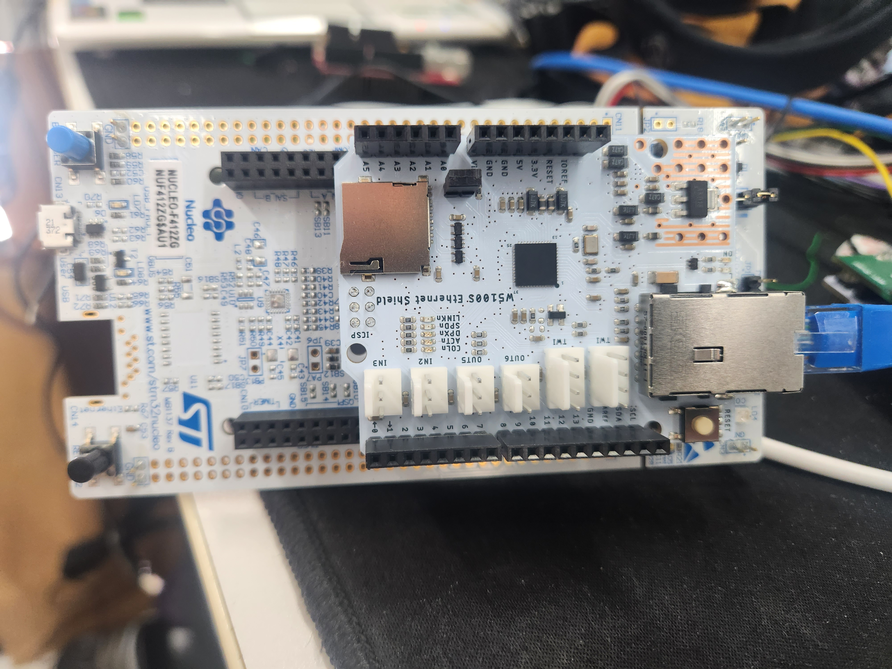</img>

## Project Set
- PIN Config

    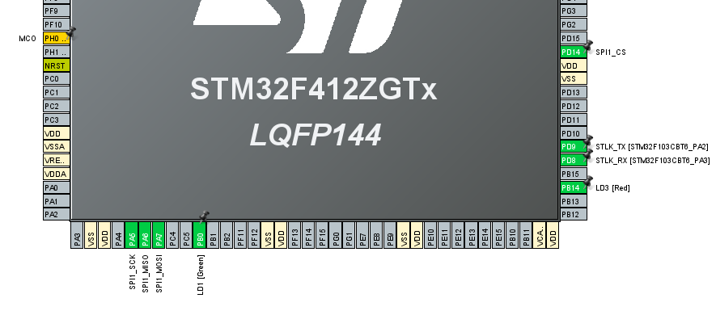</img>

- CLK Config

    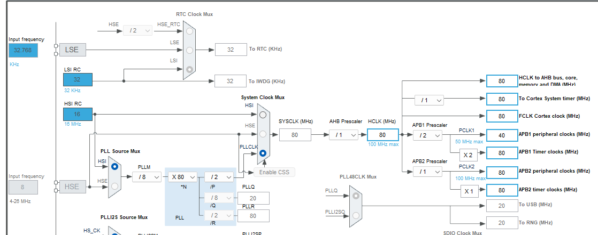</img>

- GPIO Config

    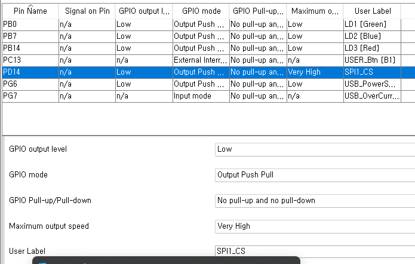</img>

- SPI Config
    - Parameter Settings

        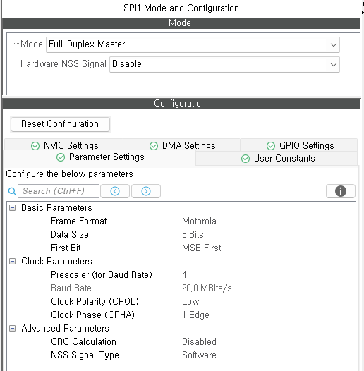</img>

    - DMA Settings

        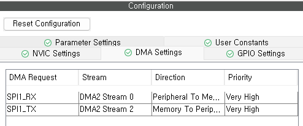</img>

## Program Seq

- Program Diagram

    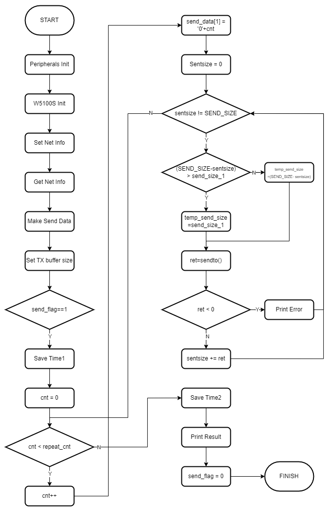</img>

- SPI Config Code
    <pre>
    <code>

    void csEnable(void)
    {
        HAL_GPIO_WritePin(SPI1_CS_GPIO_Port, SPI1_CS_Pin, GPIO_PIN_RESET);
    }

    void csDisable(void)
    {
        HAL_GPIO_WritePin(SPI1_CS_GPIO_Port, SPI1_CS_Pin, GPIO_PIN_SET);
    }

    void spiWriteByte(uint8_t tx)
    {
        uint8_t rx;
        while (HAL_SPI_GetState(&hspi1) != HAL_SPI_STATE_READY);
        HAL_SPI_TransmitReceive(&hspi1, &tx, &rx, 1, 10);
        while (HAL_SPI_GetState(&hspi1) == HAL_SPI_STATE_BUSY_TX);    
    }

    uint8_t spiReadByte(void)
    {
        uint8_t rx = 0, tx = 0xFF;
        while (HAL_SPI_GetState(&hspi1) != HAL_SPI_STATE_READY);
        HAL_SPI_TransmitReceive(&hspi1, &tx, &rx, 1, 10);
        while (HAL_SPI_GetState(&hspi1) == HAL_SPI_STATE_BUSY_RX);
        return rx;
    }

    static void wizchip_read_burst(uint8_t *pBuf, uint16_t len)
    {
        HAL_SPI_Receive_DMA(&hspi1, pBuf, len);
        while (HAL_DMA_GetState(hspi1.hdmarx) == HAL_DMA_STATE_BUSY);
        while (HAL_SPI_GetState(&hspi1) == HAL_SPI_STATE_BUSY_RX);    
        return;
    }

    static void wizchip_write_burst(uint8_t *pBuf, uint16_t len)
    {
        HAL_SPI_Transmit_DMA(&hspi1, pBuf, len);
        while (HAL_DMA_GetState(hspi1.hdmatx) == HAL_DMA_STATE_BUSY);
        while (HAL_SPI_GetState(&hspi1) == HAL_SPI_STATE_BUSY_TX);
        return;
    }
    </code>
    </pre>

## Test Config

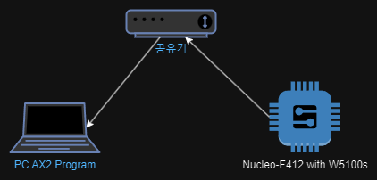</img>

## Result
- Program Log

    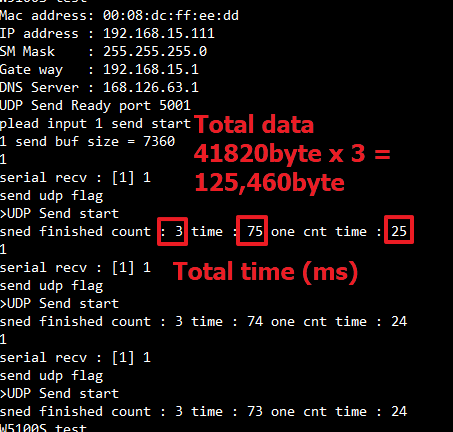</img>

- AX2

    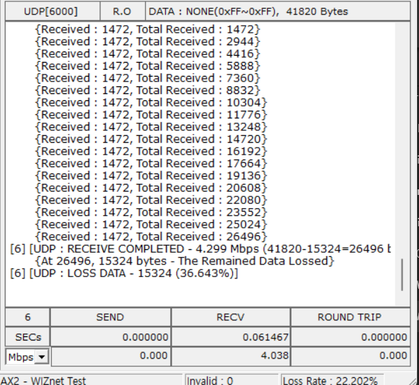</img>

- WireShark

    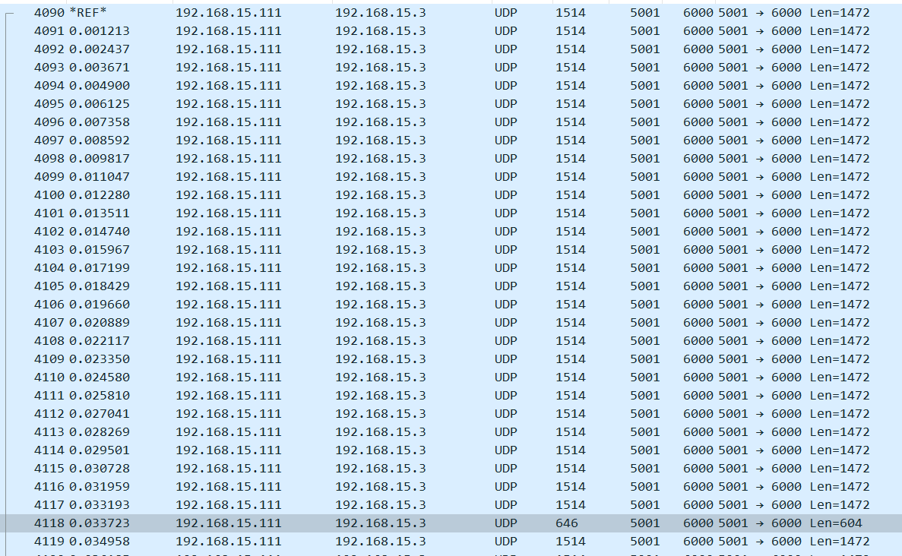</img>

    When transmitting 41,820 bytes using UDP, with a TX buffer allocated at 8K and an SPI clock at 20 MHz utilizing DMA, the results indicated that each transmission took approximately 25 to 35 milliseconds.